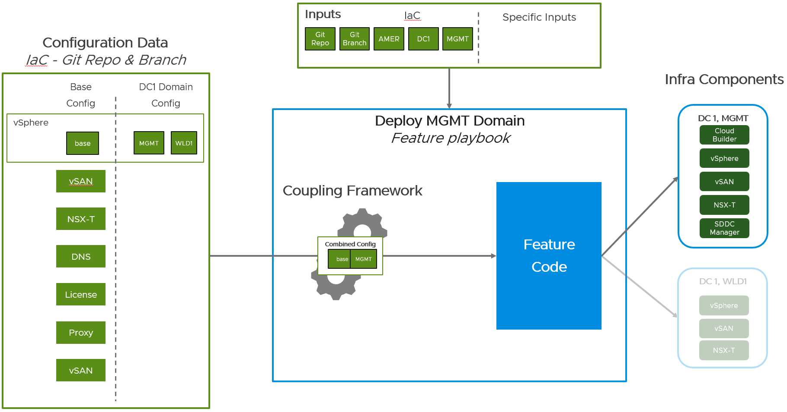
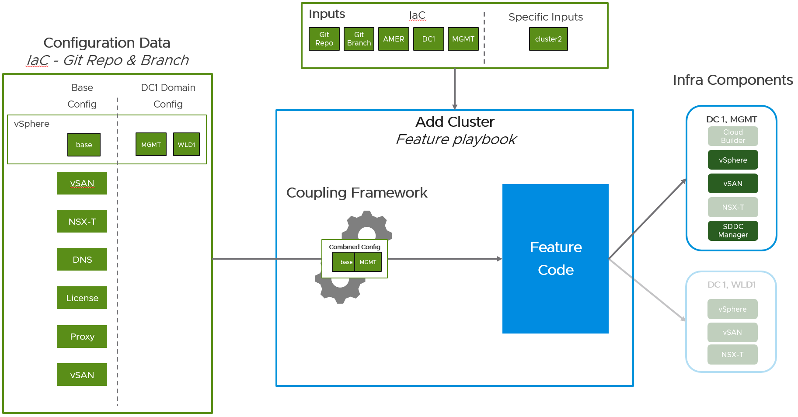

# High-Level Design

All features are executed individually. 

All features operate using the same High Level Design, detailed here.  

## Design Criteria

The design takes into consideration the following:

1. Each feature must be usable standalone.
   1. Each feature must be initiated by its own Ansible Playbook.
   1. Each feature must encompass/orchestrate any tasks necessary to complete its goal.
2. Each feature must clearly indicate input expectations.
3. Each feature must operate against specific component(s) of a workload domain, or even sub-components (_e.g._, specific cluster, specific hosts, etc).
4. a common set of configuration must exist to represent the infrastructure across multiple regions, datacenters, VCF instances, and workload domains.
5. Each feature must be unaware of the full common configuration structure (multiple regions, datacenters, etc).

## Design Overview

### Design Components

The design has 4 key elements:

1. Configuration Data
    - initial interface point for administrators and users
    - configuration represents the Infrastructure logically
      - this method is known as Infrastructure-as-Code, or IaC
      - specification is across several YAML files, following a specific folder structure
    - the IaC represents multiple regions, datacenters, VCF instances, and domains
    - is held in a separate repository
    - typically does not contain Playbook-specific information
    - details about the IaC configuration can be found in the [Infrastructure-as-Code page](../design/infrastructure-as-code/index.md)
2. feature Code Component
    - automation code - Ansible roles, Python code, etc. - which performs a specific task for a feature
      - multiple may be present for a specific feature
    - Inputs:
        - _(Required)_ configuration dataset for a specific region/datacenter/VCF/domain. It uses specific portions as it needs to
        - _(Optional)_ additional more-specific inputs, typically to help filter from the entire configuration dataset (ex: cluster name)
        - Inputs typically are sets of _dictionary_ Ansible inputs, which represent objects (often times multi-level, such as the `vsphere.datacenter.clusters` list)
3. Coupling Framework
    - mechanism to translate all Configuration IaC Data to a configuration dataset for a specific region/datacenter/VCF/domain
    - Inputs:
        - _(Required)_ inputs for a IaC repo location and branch to pull down
        - _(Required)_ inputs for a specific region, specific datacenter, specific VCF instance, specific domain
        - details can be found under [Coupling Framework](#coupling-framework) below
4. Feature Playbooks
    - orchestration playbook which ties the Coupling Framework and (sets of) Feature Code
    - Inputs:
        - _(Required)_ inputs for a IaC repo location and branch to pull down
        - _(Required)_ inputs to guide the Coupling Framework to retrieve the configuration dataset for the specific region/datacenter/VCF/domain
        - _(Optional)_ additional more-specific inputs, typically to help filter from the entire configuration dataset (ex: cluster name)
        - specific details for each can be found in their own pages, as called out in the features

### Execution Mechanisms

The following shows the [Design Components](#design-components) and how they interact with each other when the playbook is executed with a given set of inputs. 

The diagrams show how the infrastructure components are selectedModule: `this mechanism (making the other items more transparent if they will not be interfaced with).

#### IaC Data Only

The following diagram shows an example of a management domain playbook which only needs the (required-by-all) configuration dataset for a specific region/datacenter/instance/domain, along with the location of the repository and branch to retrieve the IaC data.

The Feature Code Component(s) which are called by the playbook would simply pick up the dataset they need from the entire dataset, and they do not need to have additional filtering or sub-selection to aid them in targeting their system. Specifically for this example, the Feature Code would pick up almost all of the items within the IaC dataset for the management domain and use it, including the `vcf_installer` info to target, etc.

#### IaC Data and Additional Inputs

The following diagram shows an example of an **Add Cluster** playbook, which needs the (required-by-all) IaC repository and branch, and inputs for the configuration dataset for a specific region/datacenter/instance/domain, _along with_ the cluster name that should be filtered against.

## Coupling Framework

The [Infrastructure-as-code (IaC)](../design/infrastructure-as-code/index.md) resides in the same repoitory, following the structure defined in the linked file.

As such, it must be consolidated before running it can be used by additional automation. This activity is handled using a _common_ `get_settings` role.

`get_settings` performs the following:

1. Clones the repository locally.
2. Uses the [IaC Loader](../design/infrastructure-as-code/iac-loader.md) to combine configuration into a single resolved set for a specific region, datacenter, instance, and domain
    - The region, datacenter, instance, and domain are required inputs.
3. Loads the variables from the YAML files into memory.
    - Results in (for example) the variables in `dns.yml` (_e.g._, the `dns:` dictionary) to be loaded into memory under `{{dns.}}`
    - This allows any Ansible roles executed thereafter to automatically be provided the correct variables.

## Design Constraints

### Procedural Approach (vs Desired State)

As the [goals of deliverables](../index.md) calls out, the use cases do not include the ability to detect the current system configuration and remediate for any drift from the inputs desired configuration. As such, the functions provided by the features are procedural in nature, and not a desired-state configuration.

The implications, for the current codebase, are:

- Running the code again may be possible, though only if the state of the system matches the same initially-expected state. If some process is underway and some builds are partially successful, then you should use VCF Installer or SDDC Manager to continue the operation after remediating the issue.
- There cannot be an all-encompassing playbook that would allow combining an entire _"Configure VCF instance"_ with all features combined, as this type of playbook could only be appropriately successful if each feature could detect the configuration and update or gracefully continue.

Portions of this feature could be added at a later phase to help start to build out some levels of detection. For example, a first phase could detect if the system is present at all and assume it's correct, while a later phase could try to inspect and adjust key configuration items; and a phase later-still could inspect less critical configurations and try to re-configure them.

### Targeted Configuration

As a result of the [Procedural Approach](#procedural-approach-vs-desired-state), the design must provide a way to execut rach feature against specific targets in the system. Sometimes these are easy to determine. For example:

- _"Configure NSX"_ would simply look at `nsx.` inputs from all passed in configuration), while other times it may need additional inputs to indicate which specific subitems to use. 
- _"Add Cluster"_ would need to know the name of the cluster to operate against under an entire input `vsphere.datacenter.clusters` list from a domain.

## Dependencies and Prerequisites

Each feature will call out any expected dependencies and pre-requisites in its own feature.

For example, for the [management domain](../features/day1/instance.md), the deployment prerequisites call a VCF Installer is expected to already be deployed and in a state where it can take on a new request, the hardware is configured, the ESX hosts are imaged, etc.

## Password Handling

In order to provide passwords to the system, they can be specified as specific Ansible variables when executing the automation. The specific feature code will call out the expected password variables it's looking for.

The IaC dataset should **not** hold passwords. However, the basic passwords for the samples may reside in the sample dataset for testing convenience.

### IaC Datasets

The provided datasets from the serve only as examples. These should _not_ be copied entirely as it will not match your build-out specifications. As part of copying the changes, the following should be considered:

- The global / base defaults (highest-level config) may work as-is, or with very little modifications.
    - Most of the 'common' configuration and the naming schemas proposed can be useful to keep in the common highest-level areas.
- The sample configuration can be cloned into a separate location and data can be altered.
